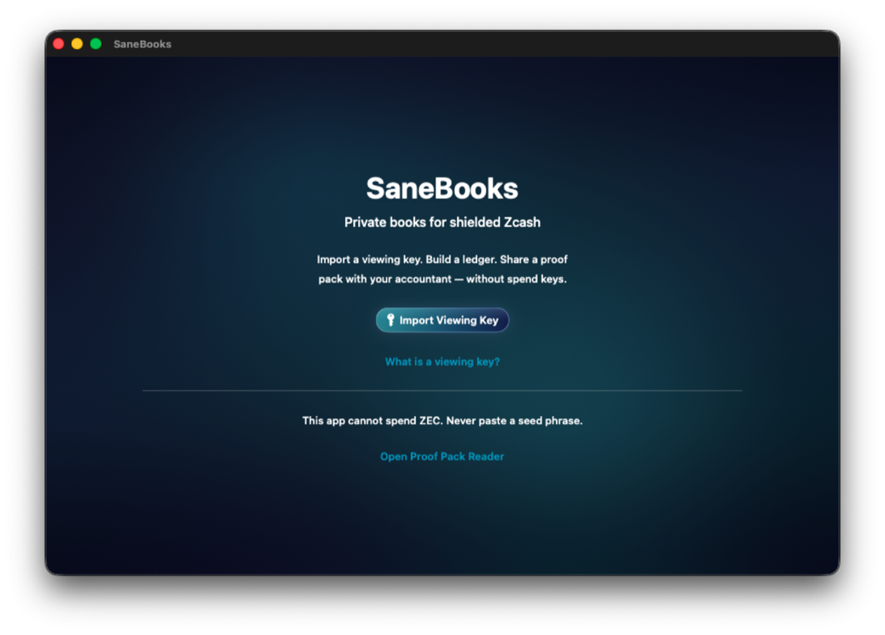
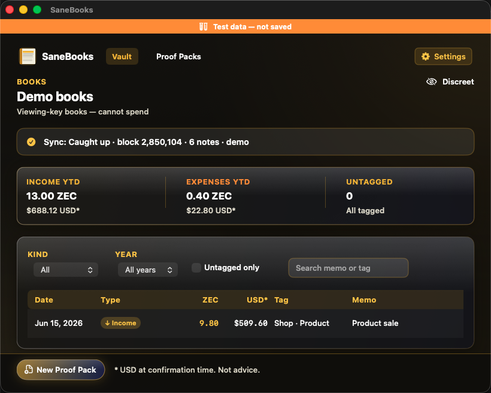
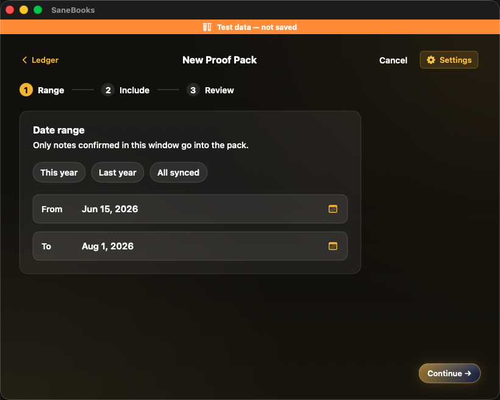
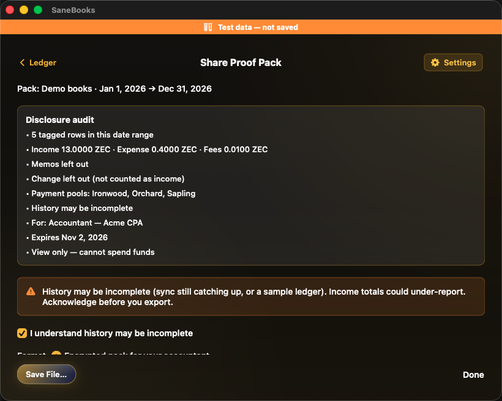
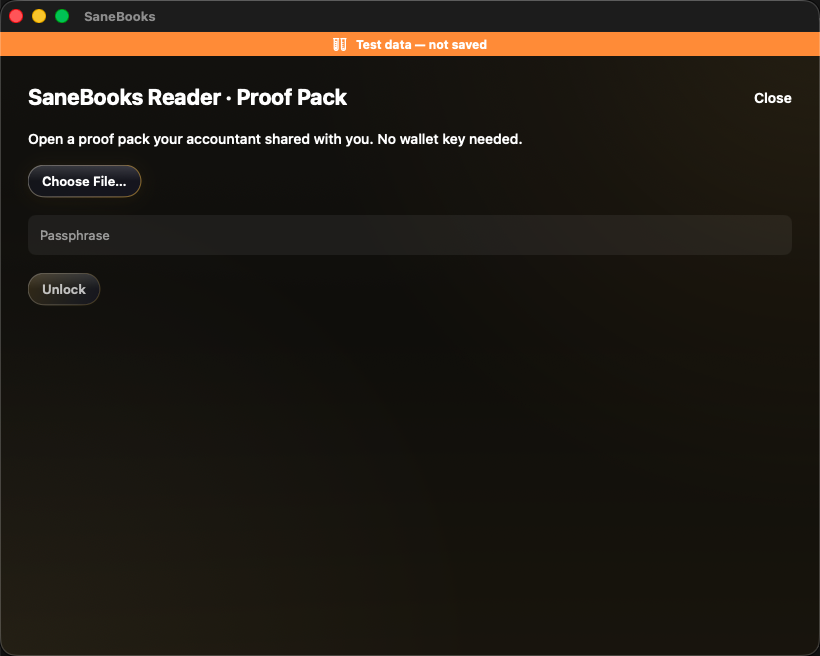

# SaneBooks

<p align="center">
  
</p>

**Private books for shielded Zcash** — Mac-native, local-first. Import a viewing key, classify income / change / expense, and share a scoped proof pack with your accountant. **Cannot spend ZEC.**

**[Download notarized v0.1.0](https://github.com/sane-apps/SaneBooks/releases/tag/v0.1.0)** · **100% Transparent Code** under [PolyForm Shield](LICENSE) (not casual “open source”)

| Welcome | Ledger | Proof pack |
|:---:|:---:|:---:|
|  |  |  |

| Share with disclosure | Accountant Reader |
|:---:|:---:|
|  |  |

CipherPay gets you paid privately. [ZBooks](https://github.com/AustinChris1/ZBooks-SIWZ) runs team treasury. **SaneBooks** is the Mac CPA layer: change ≠ income, and an expiring `.sanebooks` pack — not a permanent UFVK.

## The problem

Shielded Zcash already has viewing keys (ZIP 316). Merchants can take ZEC privately. What is missing is an **accountant layer**: classify change so it is not counted as income and hand a CPA a scoped artifact — not a permanent UFVK and not an unreviewed wallet dump. Fiat marks remain user/import supplied; SaneBooks does not currently claim a live price-source integration.

Community signal: [Is anyone actually using viewing keys for business accounting?](https://forum.zcashcommunity.com/t/is-anyone-actually-using-viewing-keys-for-business-accounting/56300) (Jun 2026).

## The solution

| Step | What happens |
|------|----------------|
| 1 | Import a **UFVK** (`uview…`) for bookkeeper mode (or **UIVK** for receivables-only, with a permanent degraded-mode banner) |
| 2 | Sync compact history via lightwalletd (`ZcashLightClientKit` 2.7.0-rc.4; demo via `SANEBOOKS_FORCE_MOCK=1`) |
| 3 | Tag rows: Income / Expense / Change / Fee — change is excluded from income totals |
| 4 | Build an encrypted, Reader-expiring `.sanebooks` pack or intentionally export non-expiring plaintext CSV/PDF |
| 5 | Accountant opens **Reader** mode — read-only rows, no vault key, no chain sync |

The Appearance settings include persisted **Standard**, **Large**, and **Extra Large** text sizes. This is app-managed because [Apple documents that SwiftUI Dynamic Type does not change text size on macOS](https://developer.apple.com/documentation/swiftui/environmentvalues/dynamictypesize); the large layouts scroll instead of compressing or hiding primary controls.

## Non-goals

- **Not a wallet** — no seeds, no spending keys, no send UI
- **Not CipherPay** — CipherPay is merchant checkout / IVK payment detect; SaneBooks starts after money arrives
- **Not ZBooks** — [ZBooks](https://github.com/AustinChris1/ZBooks-SIWZ) is team/DAO treasury + SIWZ + approved ZIP 321 payouts (web). SaneBooks is solo owner → CPA on a local Mac with expiring proof packs
- **Not tax software** — we export accountant-ready rows; the CPA owns filing
- **Not “temporary UFVK access”** — viewing keys are irrevocable; share **packs**, not raw keys

## Security invariants

1. Reject seed phrases and spending-key strings at import
2. Prefer bookkeeper mode on **UFVK**; UIVK never claims complete books
3. Proof packs carry fingerprint + classified rows only — **never** embed UFVK/UIVK
4. Pack footer names lightwalletd endpoint + tip height + “assumes honest LWD”
5. No iCloud / CloudKit for vault data; the imported key uses ThisDeviceOnly Keychain storage. Live sync also creates sensitive, owner-only Zcash SDK account data in backup-excluded Application Support storage.
6. CSV/PDF are plainly labeled non-expiring plaintext; only `.sanebooks` is encrypted and Reader-expiring
7. Pack format v2 uses PBKDF2-HMAC-SHA256 (600,000 iterations), ChaCha20-Poly1305, authenticated canonical headers, and encrypted private metadata

## Ironwood honesty

NU6.3 / Ironwood activated on mainnet at height **3,428,143** ([ZIP 258](https://zips.z.cash/zip-0258)). New shielded receives land in Ironwood, not Orchard.

SaneBooks links **ZcashLightClientKit 2.7.0-rc.4** (Ironwood receive/sync; tracking issue [#1806](https://github.com/zcash/zcash-swift-wallet-sdk/issues/1806) closed). Live path imports a **UFVK** as view-only and syncs against a configurable lightwalletd (default `zec.rocks:443`). Demo/offline still uses `MockSyncFacade` when `SANEBOOKS_FORCE_MOCK=1` or the fixture demo key is used.

UIVK/receivables mode cannot import via the public SDK yet — that path stays degraded/honest.

## Demo path (offline)

1. Build and run (below)
2. **Import Viewing Key → Use Demo Key → Continue**
3. Wait for mock sync to catch up
4. Open a row → classify → **New Proof Pack** → export `.sanebooks` / CSV
5. **Reader** → unlock pack with passphrase

## Build, test, and run

### SaneApps Operator Overlay

Requirements: macOS 14+, Xcode 16+.

Use the project wrapper so the Mini, nonzero-test gate, framework repair, receipts, and process cleanup are all applied:

```bash
cd ~/SaneApps/apps/SaneBooks
xcodegen generate
./scripts/SaneMaster.rb verify --timeout 1800
./scripts/SaneMaster.rb verify --ui --timeout 1800
./scripts/SaneMaster.rb launch
```

Direct SwiftPM commands are focused diagnostics only, not release or E2E proof. Debug runs without the sandbox; the Release configuration enables App Sandbox, outbound networking, and user-selected files.

The current Mini audit is green for **109 Swift tests in 13 suites** and **8 executed macOS UI journeys** (with the private-wallet fixture journey explicitly skipped when no local fixture is supplied). This is Debug/test evidence, not sandboxed Release clearance.

## Screenshots / visual audit

Historical Mini captures live under:

`outputs/visual-audit-sanebooks/`

They are useful references, not proof of the current source. Current clean app-only, minimum-size user-journey captures live under `outputs/e2e/2026-08-04/final-green/cropped/`; build/test receipts live under `outputs/verify/` and are qualified in the current session handoff.

## Docs

| Doc | Purpose |
|-----|---------|
| [docs/GRANT_PROPOSAL.md](docs/GRANT_PROPOSAL.md) | Draft Coinholder-Directed Retroactive Grant application |
| [docs/COMPETITIVE_POSITIONING.md](docs/COMPETITIVE_POSITIONING.md) | vs CipherPay, Zodl, ZGo, Koinly, ZBooks |
| [docs/WALLET_VIEWING_KEY_GUIDE.md](docs/WALLET_VIEWING_KEY_GUIDE.md) | How to export a UFVK from common wallets |
| [docs/LIVE_PROBE_FUNDING.md](docs/LIVE_PROBE_FUNDING.md) | How to fund the live probe UA for a real ledger row |
| [SECURITY.md](SECURITY.md) / [PRIVACY.md](PRIVACY.md) | Threat model and data boundaries |
| [AGENTS.md](AGENTS.md) | Agent / contributor project facts |

## License

[PolyForm Shield 1.0.0](LICENSE) — source-available “Transparent Code,” not OSI open source. Contact: hi@saneapps.com
